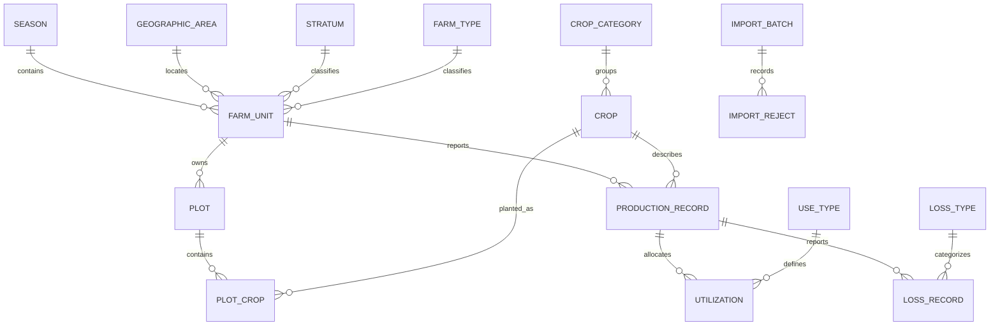

# Entity Relationship Diagram

```mermaid
erDiagram
  SEASON ||--o{ FARM_UNIT : contains
  GEOGRAPHIC_AREA ||--o{ FARM_UNIT : locates
  STRATUM ||--o{ FARM_UNIT : classifies
  FARM_TYPE ||--o{ FARM_UNIT : classifies
  FARM_UNIT ||--o{ PLOT : owns
  FARM_UNIT ||--o{ PRODUCTION_RECORD : reports
  CROP_CATEGORY ||--o{ CROP : groups
  CROP ||--o{ PRODUCTION_RECORD : describes
  PLOT ||--o{ PLOT_CROP : contains
  CROP ||--o{ PLOT_CROP : planted_as
  PRODUCTION_RECORD ||--o{ UTILIZATION : allocates
  USE_TYPE ||--o{ UTILIZATION : defines
  PRODUCTION_RECORD ||--o{ LOSS_RECORD : reports
  LOSS_TYPE ||--o{ LOSS_RECORD : categorizes
  IMPORT_BATCH ||--o{ IMPORT_REJECT : records
```

UTILIZATION and LOSS_RECORD reference farmer-crop PRODUCTION_RECORD, never plot rows. This prevents repeated farmer-crop values being counted once per plot.